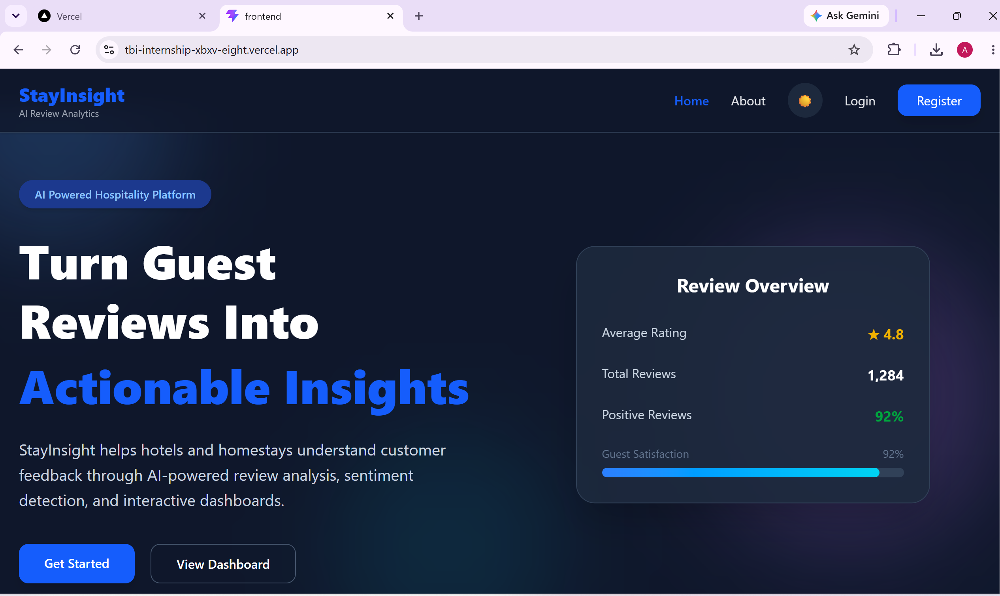
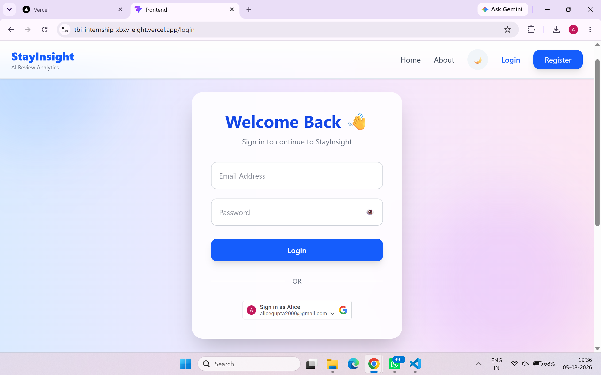
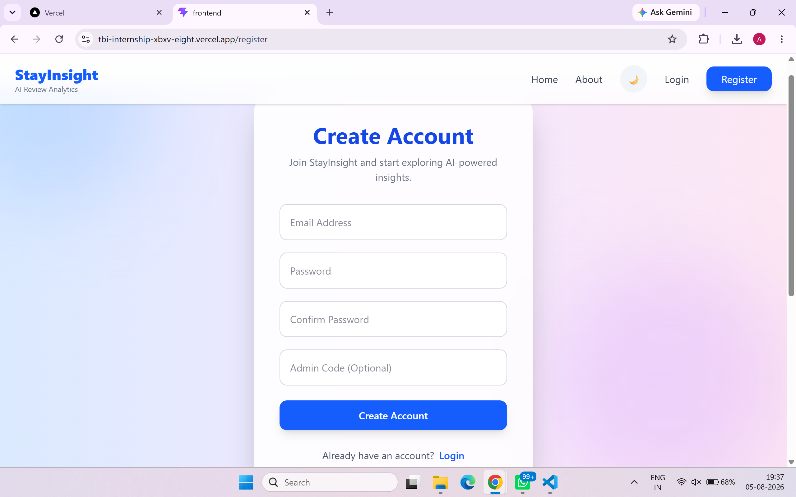
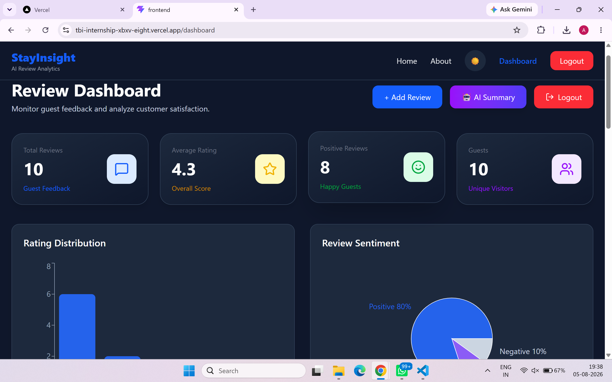
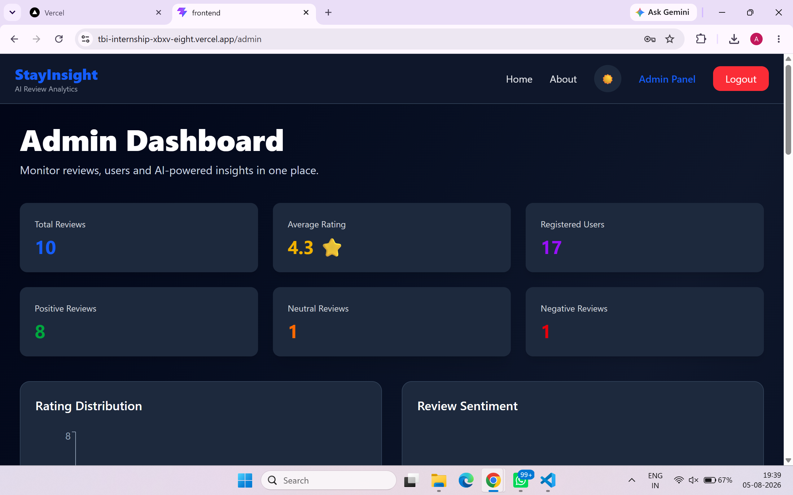
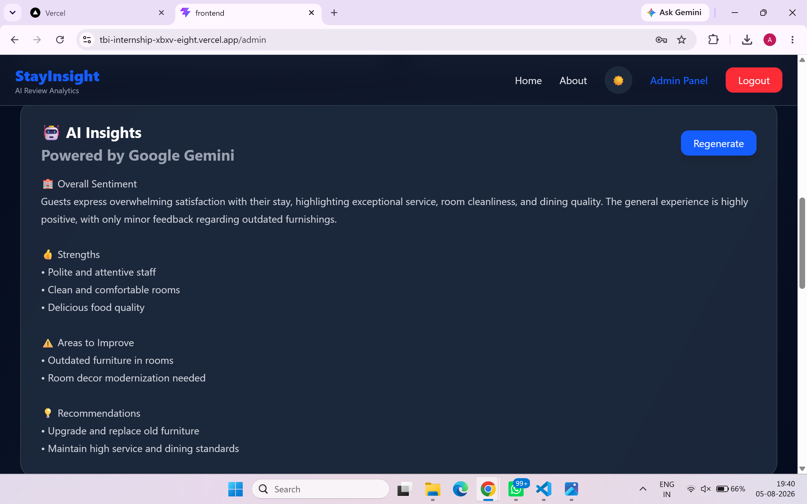

# 🏨 StayInsight – AI-Powered Guest Review Analytics Platform

StayInsight is a full-stack web application developed as part of the **TBI Internship Program**. The platform helps hotels and hospitality businesses collect, manage, and analyze guest reviews through an intuitive dashboard powered by AI.

The application allows users to securely register and log in, submit reviews, edit or delete their own reviews, and view analytics through interactive charts. Administrators have access to a dedicated dashboard with complete review management and AI-generated insights to better understand customer feedback.

---
# 🌐 Live Demo

### 🚀 Frontend (Vercel)
https://tbi-internship-xbxv-eight.vercel.app/

### ⚙️ Backend API (Render)
https://stayinsight-backend.onrender.com

---
# ✨ Features

### 🔐 Authentication
- Secure user registration and login
- Google Sign-In integration
- JWT-based authentication
- Role-based access (Admin & Customer)

### 📝 Review Management
- Add new guest reviews
- Edit existing reviews
- Delete reviews
- Search reviews by guest name or content
- Responsive review cards

### 📊 Dashboard & Analytics
- Total reviews overview
- Average rating
- Positive, Neutral and Negative review statistics
- Rating distribution chart
- Sentiment analysis pie chart

### 🤖 AI Review Summary
- AI-generated review summary using Google Gemini
- Highlights customer satisfaction trends
- Helps identify strengths and areas for improvement
- Regenerate insights anytime

### 🎨 User Interface
- Modern responsive design
- Dark & Light mode
- Smooth animations using Framer Motion
- Mobile-friendly layout
- Interactive dashboard

---

# 🛠 Tech Stack

## Frontend
- React.js
- Vite
- Tailwind CSS
- React Router DOM
- Framer Motion
- Recharts
- Lucide React

## Backend
- FastAPI
- Python
- Uvicorn
- JWT Authentication

## Database
- MongoDB Atlas
- PyMongo

## AI Integration
- Google Gemini API

## Deployment
- Vercel (Frontend)
- Render (Backend)

---

# 📁 Project Structure

```text
TBI_Internship
│
├── backend
│   ├── routers
│   ├── models
│   ├── database.py
│   ├── main.py
│   └── requirements.txt
│
├── frontend
│   ├── src
│   │   ├── components
│   │   ├── pages
│   │   ├── App.jsx
│   │   └── main.jsx
│   ├── package.json
│   └── vite.config.js
│
├── Screenshots
├── README.md
└── .gitignore
```

---

# 🗄 Database Collections

## Users

```json
{
  "email": "user@example.com",
  "password": "hashed_password",
  "role": "customer"
}
```

## Reviews

```json
{
  "guest": "Alice",
  "review": "Excellent stay and friendly staff.",
  "rating": 5,
  "created_at": "2026-08-05",
  "user_email": "alice@example.com"
}
```

---

# 🔗 API Endpoints

## Authentication

| Method | Endpoint |
|--------|----------|
| POST | `/api/auth/register` |
| POST | `/api/auth/login` |
| POST | `/api/auth/google` |

---

## Reviews

| Method | Endpoint |
|--------|----------|
| GET | `/api/reviews` |
| POST | `/api/reviews` |
| PUT | `/api/reviews/{id}` |
| DELETE | `/api/reviews/{id}` |

---

## Admin

| Method | Endpoint |
|--------|----------|
| GET | `/api/admin/stats` |
| GET | `/api/admin/reviews` |
| DELETE | `/api/admin/reviews/{id}` |
| GET | `/api/admin/ai-summary` |

---

# 🚀 Installation

## Clone the Repository

```bash
git clone https://github.com/alicegupta24/TBI_Internship.git
```

---

## Backend Setup

```bash
cd backend

python -m venv venv

venv\Scripts\activate

pip install -r requirements.txt

uvicorn main:app --reload
```

---

## Frontend Setup

```bash
cd frontend

npm install

npm run dev
```

---

# ⚙ Environment Variables

### Backend (.env)

```env
MONGO_URI=your_mongodb_connection_string
SECRET_KEY=your_secret_key
GOOGLE_CLIENT_ID=your_google_client_id
GEMINI_API_KEY=your_gemini_api_key
```

### Frontend (.env)

```env
VITE_API_URL=https://stayinsight-backend.onrender.com
VITE_GOOGLE_CLIENT_ID=your_google_client_id
```

---

# 📸 Screenshots
# Screenshots

## Home Page



---

## Login



---

## Register



---

## Customer Dashboard



---

## Admin Dashboard



---

## AI Summary



---

# ⚠️ Known Limitations

- The backend is hosted on Render's free tier, so the first request may take 30–60 seconds to respond after inactivity.
- Google Gemini AI responses depend on API availability and usage limits.
- Google OAuth requires valid Google Cloud credentials.
- The application currently supports a single hospitality business and is not yet designed for multi-property management.

---
# 🌱 Future Improvements

- Export reports as PDF
- Email notifications
- Advanced review filtering
- Hotel management integration
- Multi-language support
- Enhanced analytics dashboard

---

# ⚠️ Known Limitations

- The backend is hosted on Render's free tier, so the first request may take 30–60 seconds to respond after inactivity.
- Google Gemini AI responses depend on API availability and usage limits.
- Google OAuth requires valid Google Cloud credentials.
- The application currently supports a single hospitality business and is not yet designed for multi-property management.

---
# 🙏 Credits & Acknowledgements

This project was developed during the **TBI Internship Program**.

Special thanks to the TBI-GEU mentors for their guidance and support throughout the internship.

---

# 👩‍💻 Author

**Alice Gupta**

B.Tech Computer Science Engineering

Graphic Era (Deemed to be University)

Developed during the **TBI Internship Program (2026)**

---

## 📄 License

This project was developed for learning purposes as part of the TBI Internship Program.
